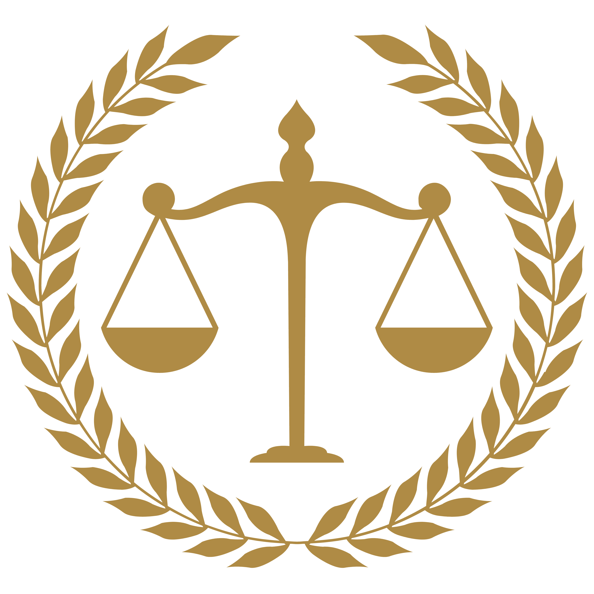
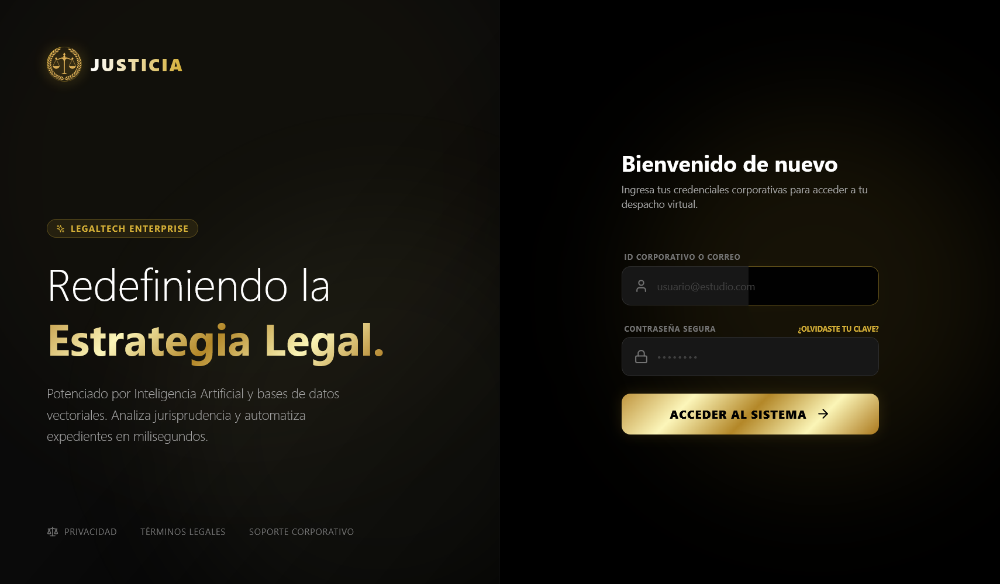
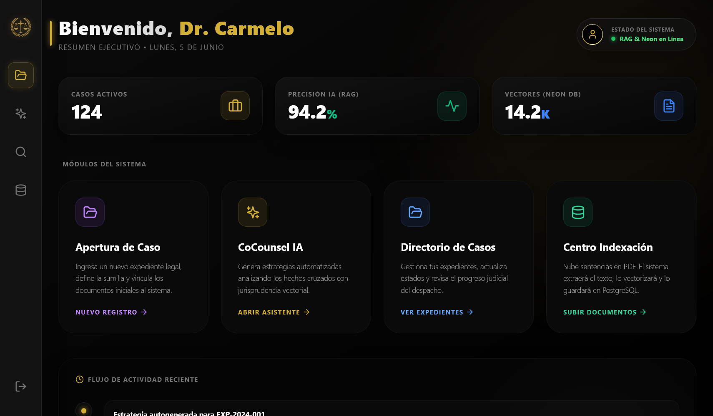
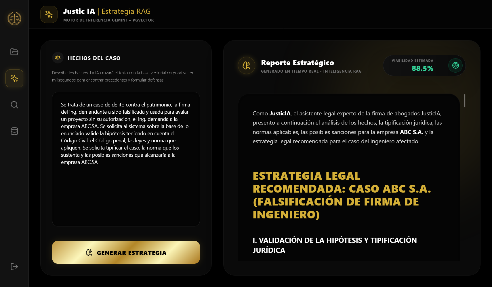
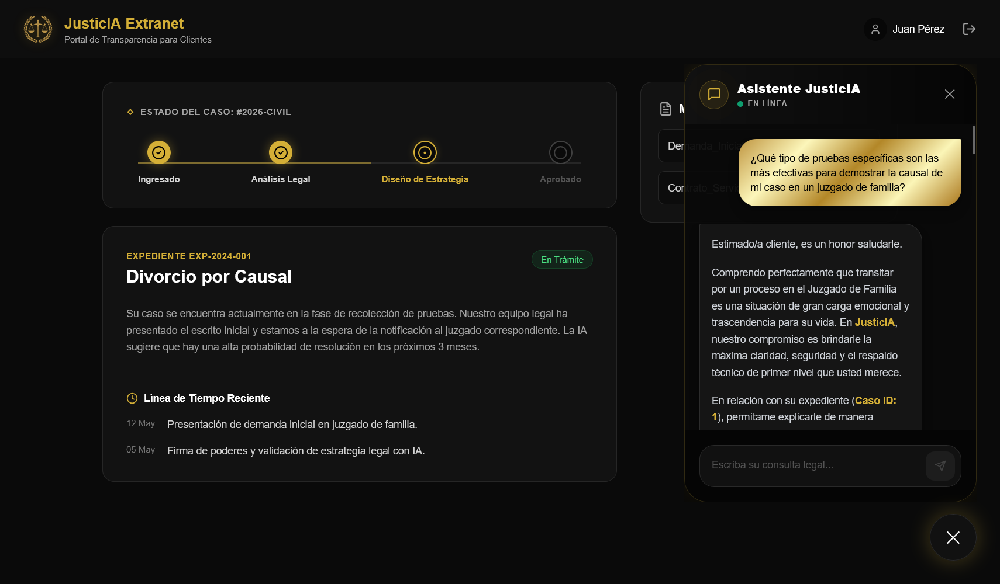
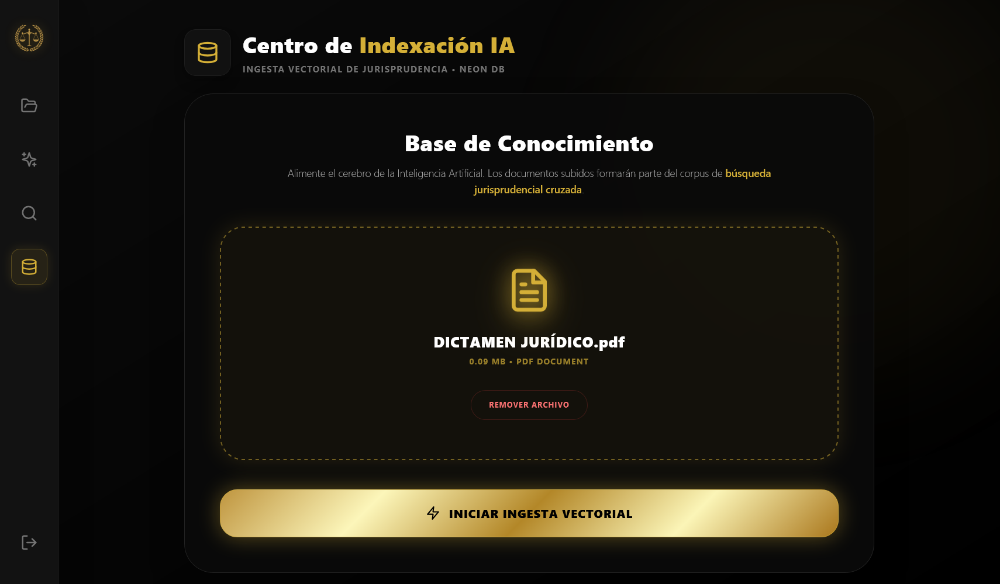
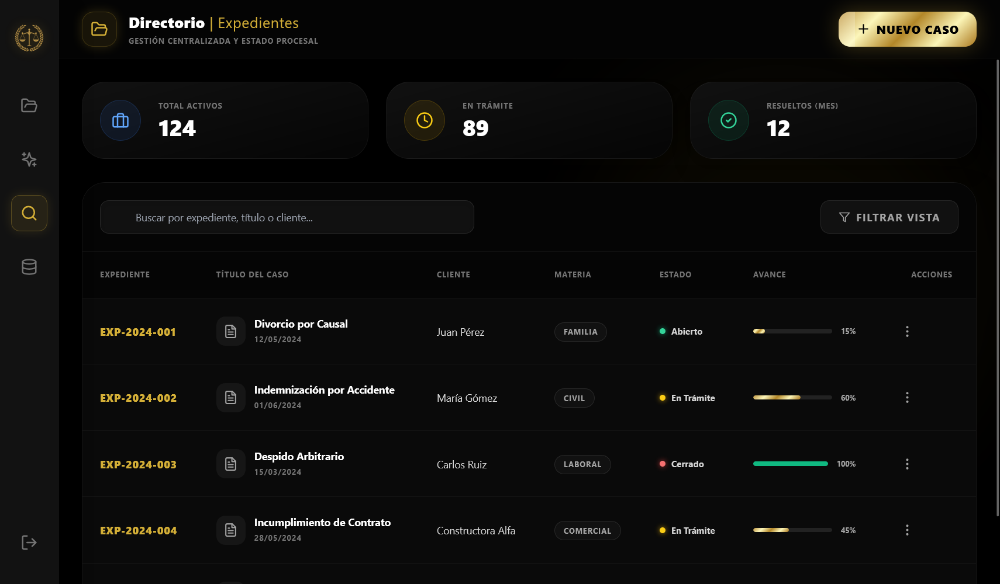
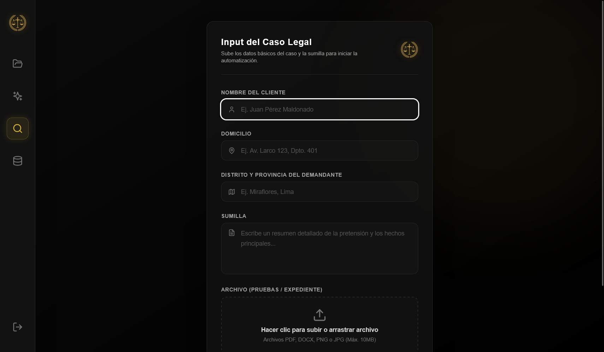

<p align="center">
  
</p>

<h1 align="center">JusticIA ⚖️</h1>

<p align="center">
  <strong>El futuro del LegalTech con Inteligencia Artificial y RAG</strong><br>
  Plataforma integral para despachos de abogados
</p>

<p align="center">
  <a href="https://proyecto-justic-ia.vercel.app" target="_blank">
    
  </a>
  <a href="demostracion.md">
    
  </a>
</p>

<p align="center">
  
  
</p>
<p align="center">
  
  
</p>
<p align="center">
  
  
</p>
<p align="center">
  
</p>

<p align="center">
    
    
    
    
    
</p>

---

## 📖 Concepto del Proyecto

**JusticIA** es un software de gestión legal y una plataforma integral de tecnología para abogados diseñada para optimizar y centralizar el trabajo en despachos jurídicos. Su propuesta de valor principal es integrar un **Asistente Legal con Inteligencia Artificial (IA)** que entiende el contexto completo de los expedientes gracias a la tecnología **RAG (Retrieval-Augmented Generation)**.

El sistema unifica las operaciones diarias del ejercicio profesional con el fin de multiplicar la productividad y reducir el caos administrativo. Pasa de un proceso de investigación manual de jurisprudencia que toma semanas, a un flujo automatizado que toma horas o minutos, asegurando predictibilidad y certeza en la estrategia legal.

### El Problema de Negocio
El estudio de abogados invierte un tiempo excesivo en realizar valoraciones jurídicas y armar estrategias legales. Esto ocurre porque la búsqueda de jurisprudencia y casos previos se realiza de forma manual y desestructurada a través de archivos físicos y carpetas de PDFs.

### La Solución
Implementar una solución tecnológica que centralice e indexe la base de conocimientos del estudio, reduciendo el tiempo de búsqueda y valoración jurídica, asegurando un porcentaje de viabilidad y éxito calculado matemáticamente en base al "Know-How" propio del estudio.

---

## ✨ Funcionalidades Principales

### 🧠 Core Business: RAG (Retrieval-Augmented Generation) en Acción
- **Motor de Búsqueda Legal Avanzado:** Búsqueda rápida e inteligente (usando similitud semántica de vectores y *Cosine Similarity*) dentro de la jurisprudencia y casos históricos del estudio.
- **Valorador Jurídico con IA:** Interfaz *Split-Screen* (pantalla dividida) donde se ingresan variables del caso y el LLM (Gemini) cruza esa información con la jurisprudencia recuperada, forzándolo a basar su estrategia *solo* en los documentos encontrados. Esto cura la clásica "amnesia" o alucinación de los modelos de IA.
- **Generación Automática de Estrategias:** Análisis estructurado y cálculo porcentual predictivo de viabilidad basado en el historial legal del estudio.

### 🏗️ Ingesta de Datos y Gestión del Conocimiento
- **Digitalización Inteligente:** Permite subir expedientes y leyes en formato PDF o imágenes para ser escaneados y analizados.
- **Procesamiento de Texto y Embeddings:** Extracción de texto, segmentación (chunking) y vectorización de documentos legales. Cada fragmento de texto se convierte en una representación matemática almacenada en la base de datos.
- **Estructura Organizacional Integral:** Soporte para todas las ramas vitales del estudio: Derecho Civil, Penal, Defensa del Consumidor, Constitucional, entre otras.

### 🤝 Portal del Cliente (Extranet)
- **Línea de Tiempo (Timeline):** Visualización clara de la fase en la que se encuentra el proceso judicial del cliente.
- **Chat Interactivo 24/7:** Asistente virtual conectado a la IA capaz de resolver dudas legales básicas (Ej: "¿Qué es un habeas corpus?") sin consumir horas facturables del abogado.
- **Carga de Documentos y Evidencias:** El cliente puede subir pruebas o documentos directamente a su expediente digital desde la comodidad de su hogar.

### 🔐 Seguridad y Gestión de Roles
Un robusto sistema de control de acceso enrutado de forma inteligente:
- **Cliente:** Acceso restringido únicamente a su Portal y a la información de sus propios expedientes.
- **Auxiliar/Administrador:** Acceso a los módulos operativos, carga masiva de expedientes, digitalización y manejo de la agenda.
- **Abogado/Socio:** Acceso a todo el ecosistema (Dashboard de Inteligencia Artificial, motor RAG, diseño de estrategias y estadísticas globales).

---

## 🛠️ Arquitectura y Tech Stack

| Capa | Tecnología | Descripción |
|----------|------------|-------------|
| **Frontend UI** | React + Vite | Interfaces ultra rápidas y modernas construidas bajo el paradigma de componentes. |
| **Diseño y UX** | Tailwind CSS | Interfaz "Glassmorphism" con experiencia de usuario nivel Enterprise. |
| **Backend API** | Python + FastAPI | Motor y API ultrarrápida para manejar lógica de negocio, búsquedas semánticas e inyección de prompts. |
| **Base de Datos** | PostgreSQL (Neon) | Base de datos relacional en la nube con la extensión `pgvector` activada para almacenamiento de embeddings. |
| **Cerebro (IA)** | Google Gemini | Generación de texto estructurado (LLM) y creación de Vectores de 768 dimensiones. |

---

## 🗄️ Modelo de Datos (Diseño Relacional)

El sistema opera con un modelo de datos robusto preparado para alta escalabilidad:

1. **Módulo de Personal y Accesos:**
   - `Empleado`: Registro del personal corporativo (abogados, socios, auxiliares).
   - `Rol_Sistema`: Tabla paramétrica de permisos y niveles de acceso en la plataforma.
   - `Usuario_Credencial`: Manejo de seguridad, cifrado de contraseñas e inicio de sesión.
2. **Módulo de Clientes y Contratos:**
   - `Cliente`: Entidades naturales o jurídicas (RUC/DNI) a las que se defiende.
3. **Módulo de Expedientes y Casos (El Núcleo):**
   - `Caso_Legal`: Carpeta centralizadora de los hechos, el área legal y el estado procesal.
4. **Módulo de Inteligencia Artificial:**
   - `Documento_Adjunto`: Archivos subidos con su texto extraído (FTS) y su campo `vector` para búsquedas semánticas.
   - `Estrategia_IA`: El informe inmutable generado por Gemini con los precedentes encontrados y el porcentaje de viabilidad.
5. **Módulo Operativo:**
   - `Evento_Calendario`: Citas, audiencias en juzgados y alertas de plazos procesales.
   - `Registro_Horas`: Seguimiento del tiempo de trabajo invertido por el personal (Time Tracking).

<p align="center">
  
</p>

---

## 📂 Project Structure

La estructura de carpetas ha sido diseñada para una fácil mantenibilidad, separando la interfaz de usuario de las integraciones de backend y API:

```text
justicia-frontend/
│
├── src/
│   ├── assets/              # Imágenes, logos, íconos y capturas del sistema
│   ├── components/          # Componentes reutilizables y modulares
│   │   ├── layout/          # Sidebar, Navbar, Footer
│   │   ├── ui/              # Botones, Modales, Inputs estilizados (shadcn/ui)
│   │   └── legal/           # Tarjetas de jurisprudencia y visor PDF
│   ├── hooks/               # Custom hooks de React (ej. useFetchCases, useAuth)
│   ├── pages/               # Vistas principales (Enrutamiento por Roles)
│   │   ├── abogado/
│   │   │   ├── Dashboard.jsx
│   │   │   ├── EstrategiaLegal.jsx  # El núcleo de IA en Split-Screen
│   │   │   └── BuscadorGlobal.jsx
│   │   ├── cliente/
│   │   │   ├── PortalCliente.jsx    # Timeline de proceso y chat IA
│   │   │   └── SubirDocumentos.jsx
│   │   └── admin/
│   │       └── Digitalizacion.jsx   # Drag & Drop de PDFs para vectorizar
│   ├── services/            # Llamadas a la API de Python (Axios/Fetch)
│   │   ├── api.js           # Configuración base y credenciales
│   │   └── casosService.js
│   ├── utils/               # Funciones de ayuda (formateo de fechas, validadores)
│   ├── App.jsx              # Enrutador principal (React Router con protección de rutas)
│   └── main.jsx             # Punto de entrada y montaje de React
├── package.json             # Dependencias del Frontend
└── tailwind.config.js       # Configuración global de colores, tipografía y diseño
```

---

## 🤝 Ciclo de Vida de un Caso (D.T.E.)

El flujo completo que realiza el software desde que el cliente llega al despacho hasta que se emite la defensa:

1. **Ingresado:** Se registra el nuevo caso o consulta en el Gestor de Casos.
2. **En Búsqueda de Jurisprudencia:** El motor vectorizado localiza sentencias, códigos civiles y precedentes relevantes a la situación fáctica del cliente.
3. **Valorado:** El Valorador Jurídico con IA cruza los hechos y las sentencias para calcular matemáticamente un porcentaje predictivo de éxito/fracaso.
4. **En Diseño de Estrategia:** El abogado, basado en su "Know-How", redacta su defensa o demanda apoyado en un borrador inyectado directamente en la vista de diseño dividido (Split-Screen).
5. **Aprobado / Listo:** El caso y la estrategia pasan a revisión de los socios (Aprobación final).
6. **Timeline de Cliente:** El proceso entra en marcha y el cliente puede monitorear las audiencias a través de su extranet.

---

<p align="center">
  Hecho con ⚖️ e 🤖 por el equipo de JusticIA.
</p>
