# ⚖️ JusticIA: Demostración Funcional de la Plataforma

Bienvenido a la demostración oficial de **JusticIA**. Este documento expone el flujo de trabajo real del sistema, detallando paso a paso cómo la Inteligencia Artificial se integra de manera orgánica en el ciclo de vida de un caso legal: desde que el cliente presenta su problema hasta la formulación de la estrategia de defensa y facturación.

A continuación, exploraremos las distintas fases que componen nuestra arquitectura *LegalTech Enterprise*.

---

## 🔒 Fase 1: Control de Acceso y Enrutamiento Inteligente

El sistema cuenta con un control de acceso basado en roles (Abogado, Cliente, Auxiliar/Admin) que redirige al usuario hacia vistas personalizadas según sus permisos, protegiendo así la confidencialidad de la información.

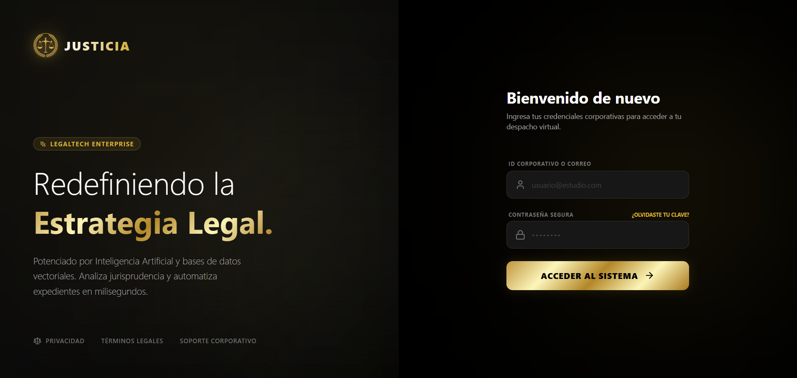
*Vista de autenticación segura donde el sistema asigna el entorno de trabajo según el perfil.*

---

## 📊 Fase 2: El Centro de Mando del Abogado

Al ingresar como Abogado o Socio, el sistema despliega un *Dashboard* integral que centraliza las operaciones del día a día, ofreciendo una vista panorámica del rendimiento del bufete y los plazos inminentes.

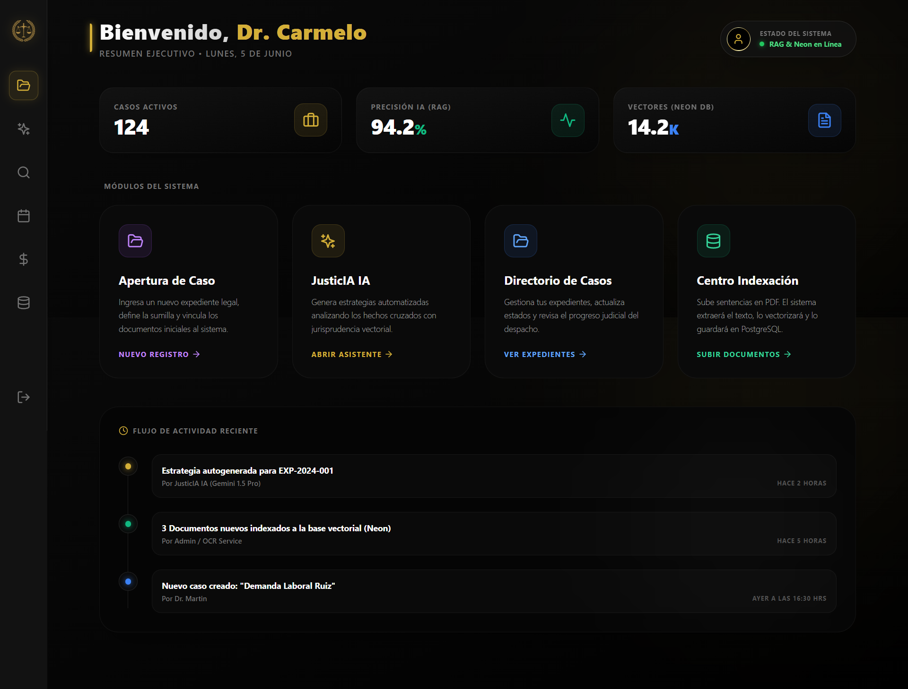
*Panel de control (Dashboard) que consolida métricas clave, tareas pendientes y alertas procesales.*

---

## 📥 Fase 3: Recepción y Automatización del Caso

La creación de un nuevo caso inicia en la interfaz de ingresos, pero la verdadera magia ocurre en segundo plano gracias a nuestra automatización.

> **Dato de Prueba (Sumilla):** Copia y pega este texto para probar el ingreso:
> *"Reclamo formal por negativa injustificada de cobertura de garantía automotriz ante fallas severas de motor a los dos meses de compra. El cliente exige el cambio inmediato del vehículo por uno nuevo o la devolución íntegra del dinero ($25,000 USD) sustentándose en la falta de idoneidad del producto y el riesgo a su integridad física."*

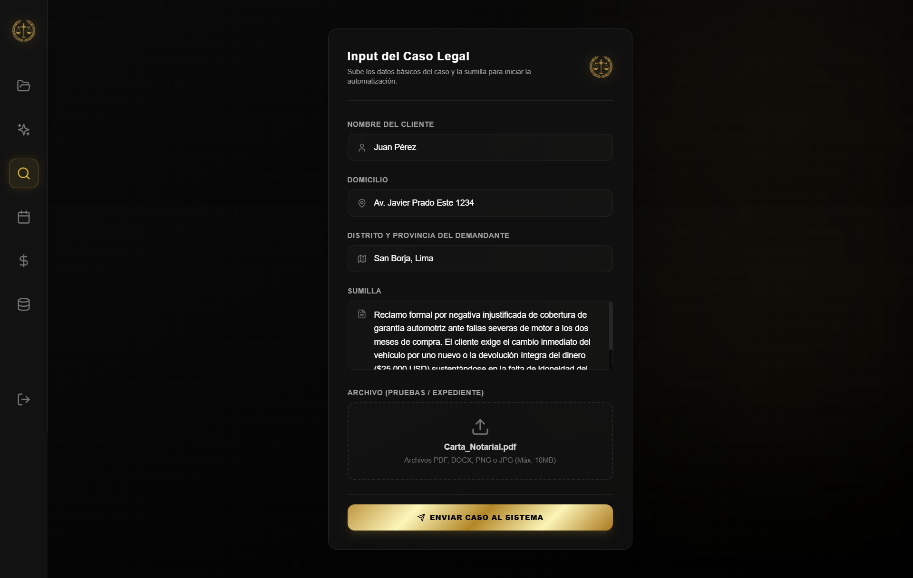
*Formulario estructurado para la recepción inicial de los hechos y la documentación del cliente.*

Una vez enviado, el flujo de trabajo automatizado **(n8n)** toma el control para sincronizar y organizar la información de manera transparente y eficiente.

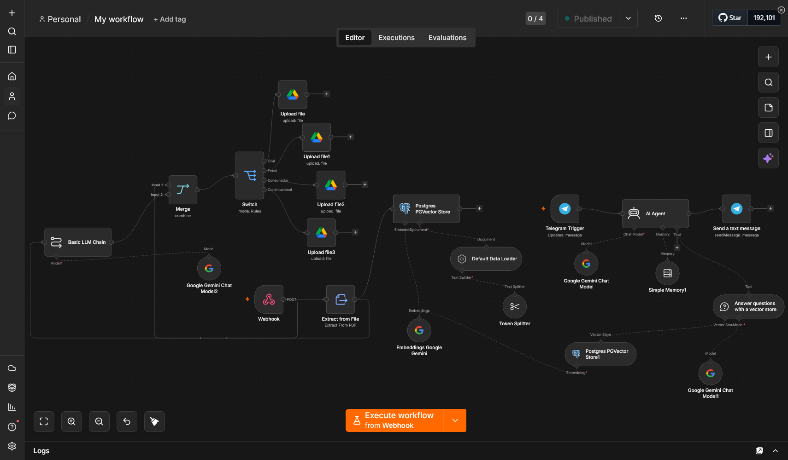
*El pipeline automatizado distribuye la carga entre la base de datos estructurada y el almacenamiento en la nube.*

Simultáneamente, los documentos adjuntos son respaldados de forma segura en **Google Drive**, clasificándolos bajo una arquitectura corporativa lógica que imita el orden de un bufete físico.

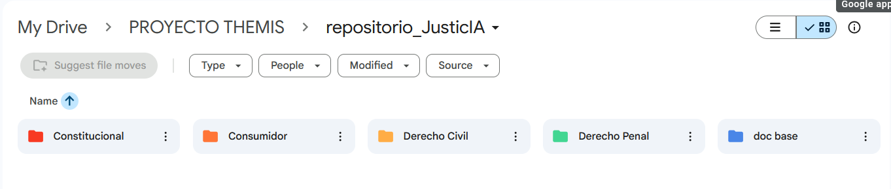
*Estructura principal del repositorio corporativo gestionado automáticamente.*

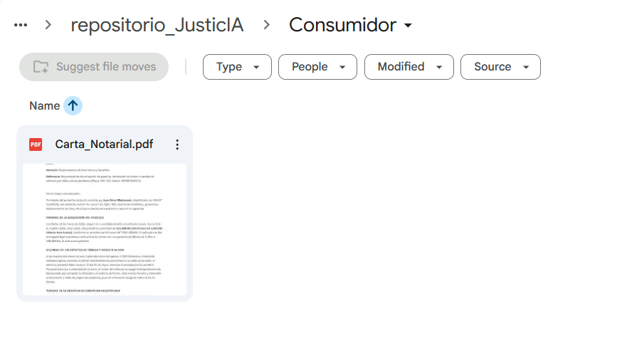
*Organización interna de un expediente de protección al consumidor, con los documentos base extraídos.*

---

## 🧠 Fase 4: Digitalización y Construcción del "Cerebro" (RAG)

JusticIA no se basa en leyes genéricas de internet, sino en la "base documental" ("doc base") del propio despacho. Esta base alberga códigos, sentencias previas y jurisprudencia.

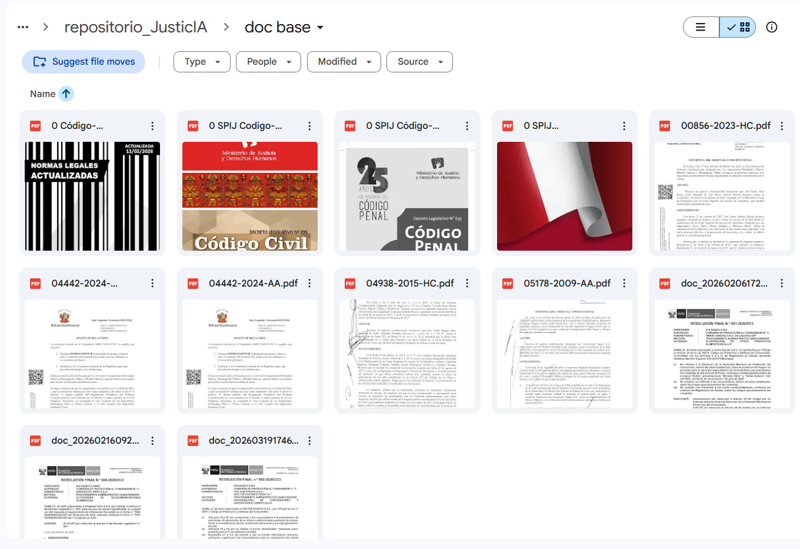
*Archivos PDF de doctrina y jurisprudencia que nutren el modelo.*

Para que el modelo (Gemini) entienda estos documentos, el Auxiliar utiliza el **Centro de Indexación**. Aquí se suben resoluciones y leyes que el sistema extrae, segmenta y vectoriza usando embeddings.

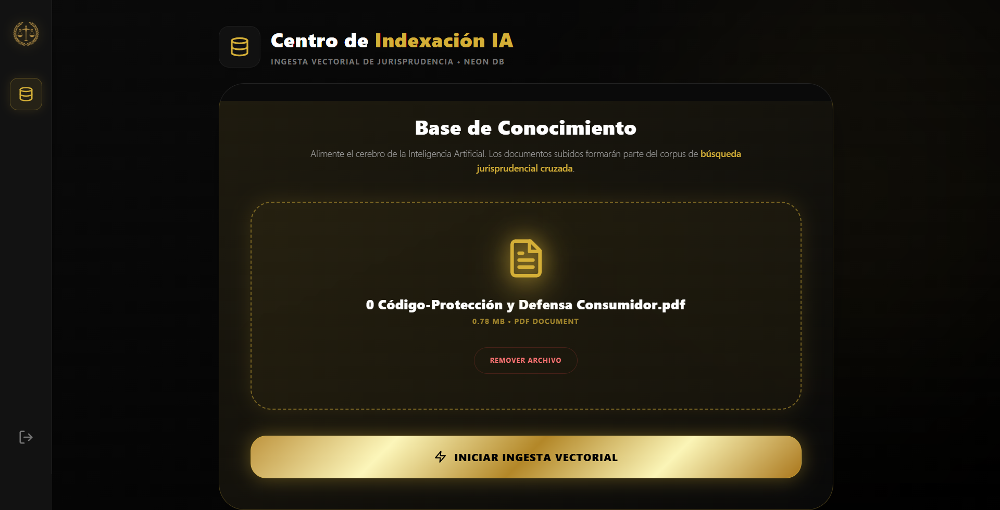
*Interfaz Drag & Drop para subir leyes, normas y resoluciones a la base de vectores.*

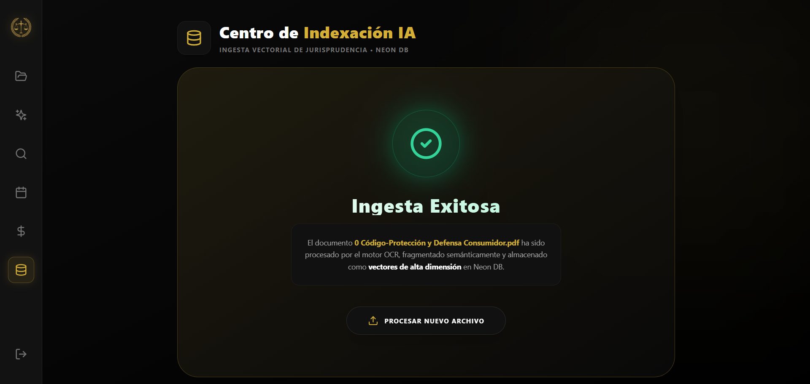
*El sistema confirma la vectorización en la base de datos Neon, logrando que el "cerebro" entienda y almacene la norma.*

---

## 🗂️ Fase 5: Gestión y Directorio de Casos

Con el conocimiento indexado y el caso ingresado, el abogado puede administrar todos los expedientes del bufete desde el directorio centralizado tipo CRM.

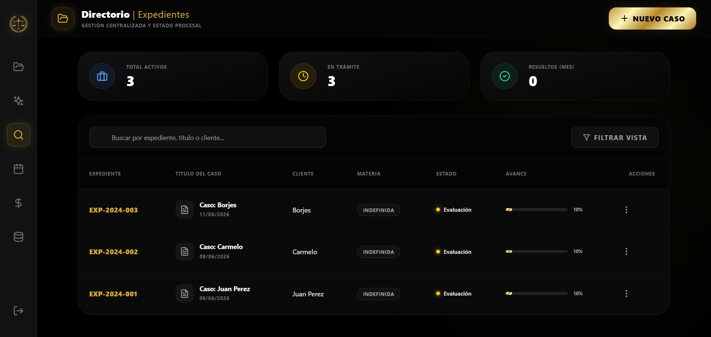
*Listado inteligente de casos legales que permite una visión general del estado y materia de los mismos.*

---

## 🔍 Fase 6: Búsqueda Semántica de Jurisprudencia

Antes de trazar una estrategia, JusticIA realiza una **Búsqueda Vectorial** para hallar casos y leyes matemáticamente similares a los hechos presentados por el cliente.

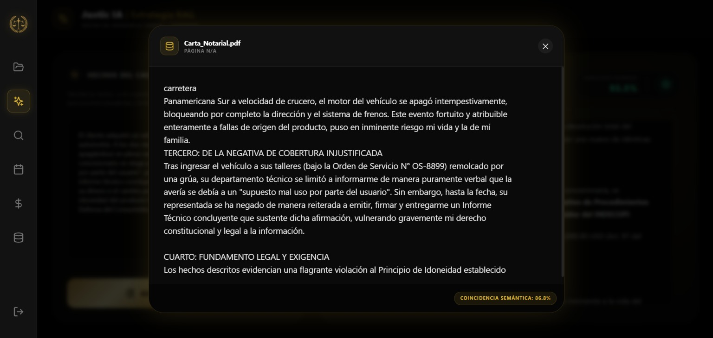
*El motor RAG recupera los fragmentos exactos de los documentos que sustentarán la defensa.*

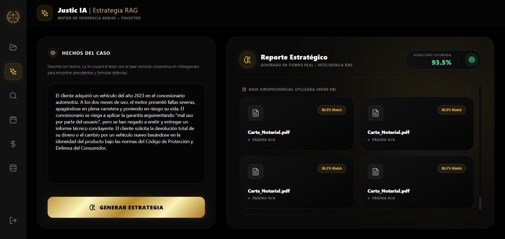
*Análisis de la similitud del coseno mostrando la relevancia de las resoluciones indexadas con respecto al caso actual.*

---

## 🤖 Fase 7: Estrategia Legal Impulsada por Inteligencia Artificial

Este es el núcleo de valor (Core Business) de JusticIA. Mediante una vista inmersiva *Split-Screen* (pantalla dividida), el sistema inyecta los hechos del cliente y la jurisprudencia encontrada directamente en el prompt del LLM (Gemini 1.5).

> **TEXTO PARA COPIAR (Hechos del Caso):**
> *El cliente adquirió un vehículo del año 2023 en el concesionario automotriz. A los dos meses de uso, el motor presentó fallas severas, apagándose en plena carretera y poniendo en riesgo su vida. El concesionario se niega a aplicar la garantía argumentando "mal uso por parte del usuario", pero se han negado a emitir y entregar un informe técnico concluyente. El cliente solicita la devolución total de su dinero o el cambio por un vehículo nuevo basándose en la idoneidad del producto bajo las normas del Código de Protección y Defensa del Consumidor.*

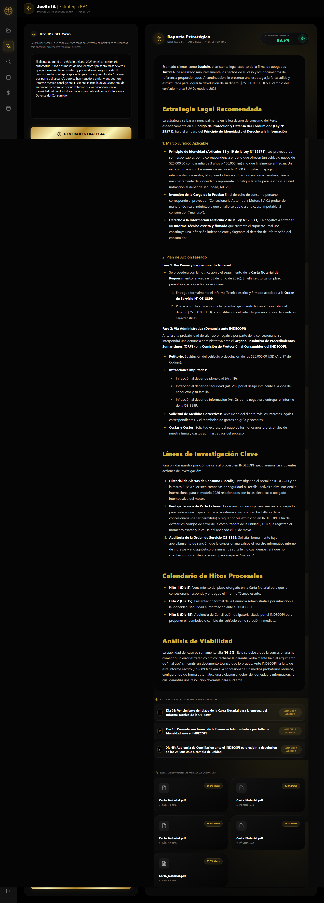
*El motor RAG analiza el caso, evita alucinaciones al basarse solo en tu jurisprudencia, emite una estrategia estructurada y calcula el Porcentaje de Viabilidad Matemática de éxito.*

Para conectar la mente legal con las operaciones del bufete, la Inteligencia Artificial sugiere directamente los **Hitos Procesales** recomendados a seguir.

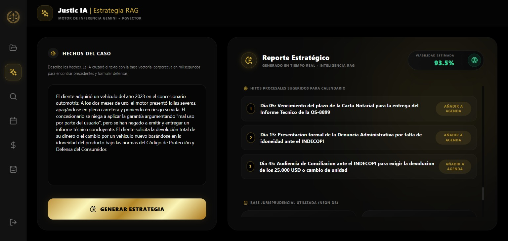
*La IA programa las actuaciones legales futuras para ser añadidas a la agenda procesal con un solo clic.*

---

## 📅 Fase 8: Operatividad y Control de Plazos (Agenda)

Los hitos sugeridos por la IA o creados manualmente se reflejan en una **Línea de Tiempo Procesal** clara. Los abogados nunca perderán un plazo perentorio gracias a este calendario centralizado.

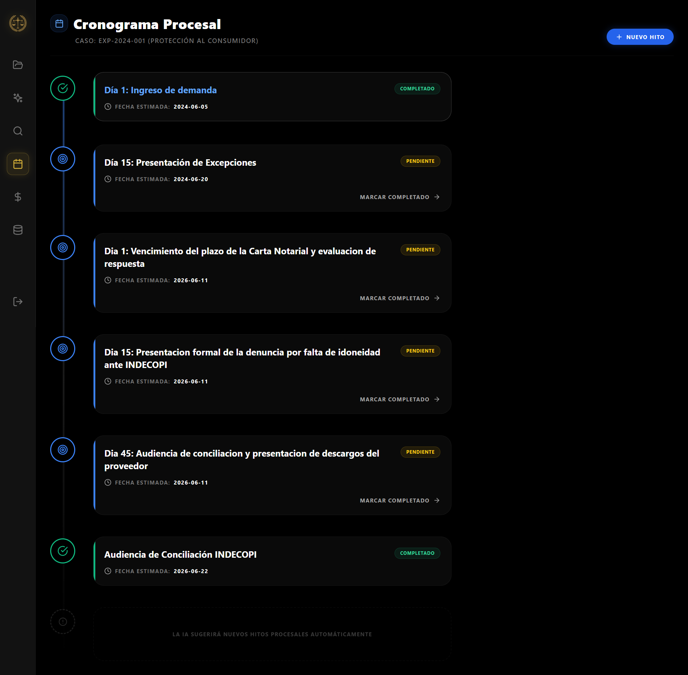
*Gestión de la agenda, mostrando audiencias, apelaciones y reuniones con alertas preventivas.*

---

## 💰 Fase 9: Monetización y Time Tracking

Un bufete eficiente necesita facturar correctamente cada minuto trabajado. El módulo de Finanzas permite registrar las horas invertidas de forma rápida y asociarlas a los casos correspondientes.

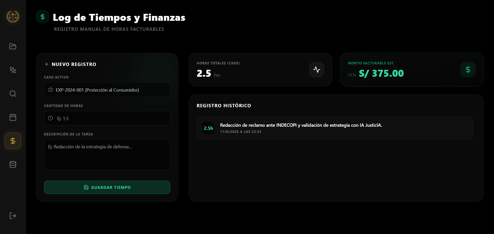
*Registro de horas facturables que actualiza dinámicamente los honorarios en Soles (PEN).*

---

## 🌟 Fase 10: Transparencia Total con el Cliente

Finalmente, JusticIA otorga a los clientes un acceso restringido (Portal del Cliente) para que sientan el avance de su caso. Pueden ver su cronograma actualizado y, para reducir llamadas innecesarias al despacho, cuentan con un asistente virtual activo 24/7.

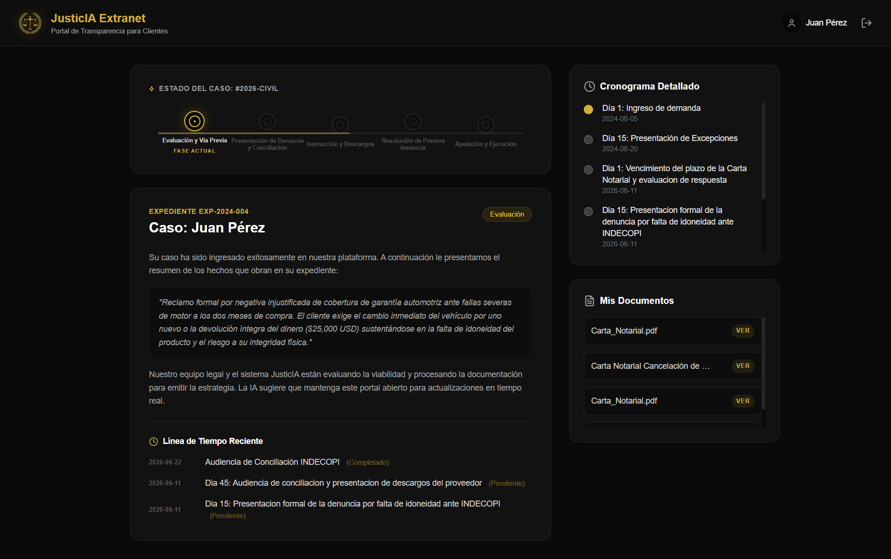
*La Extranet del cliente donde puede observar de manera visual el avance de su expediente legal.*

> **Preguntas de Prueba para la IA:**
> 
> **PREGUNTA 1:** 
> *Hola, ¿me pueden explicar en términos simples en qué consiste el principio de idoneidad que está en mi reclamo?*
> 
> **PREGUNTA 2:** 
> *¿Qué pasa si el concesionario no se presenta a la audiencia de conciliación programada?*

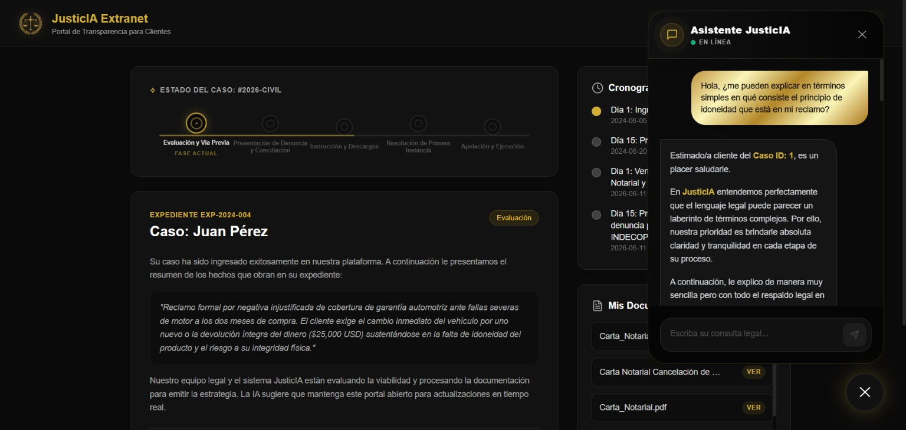
*Chatbot legal integrado mediante la API de Gemini que resuelve dudas jurídicas básicas del cliente en tiempo real.*

---

  <b>JusticIA ⚖️</b>  
  <i>Transformando la incertidumbre del papel en estrategias precisas con Inteligencia Artificial.</i>

